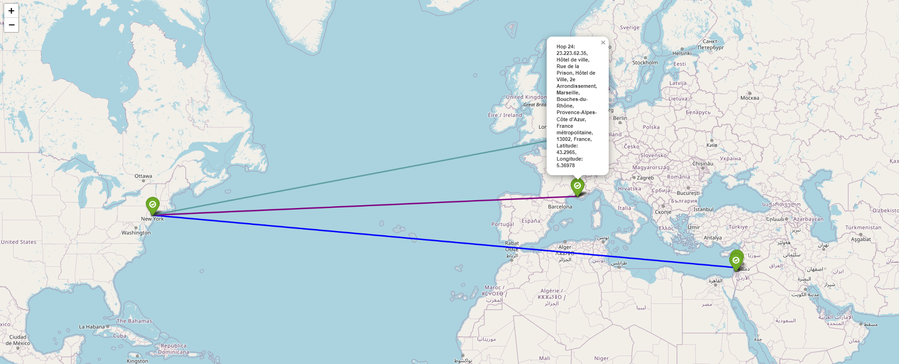

<h1>Trace Route With Folium Map</h1>

<h3>Flask Web Ui:</h3>

<h3>Result:</h3>

1.The app defines a web application that performs a traceroute to a specified destination address and displays the results on a map. 

2.The application is built using Flask and makes use of several external libraries, including scapy, geopy, and folium. 

3.The traceroute is performed using the traceroute function from the scapy library, and the location data for each hop is retrieved using the ip-api.com API. 

4.The location data is then displayed on a folium map, which is saved to an HTML file and opened in the user's default web browser. 

Overall, the code is well-structured and follows best practices for web application development in Python. However, there may be some room for improvement in terms of error handling and security, such as validating user input and handling exceptions that may be raised during the traceroute or location data retrieval processes.

<h2>How to Install</h2>
Clone the repository to your local machine using the command git clone https://github.com/OmriYahav/TraceRoute-On-Map.git
Navigate to the project directory using cd repo
Install the required dependencies using pip install -r requirements.txt

Run the application using python3 traceRouteV2.py

Open your web browser and navigate to http://localhost:5000 to view the application.

Note: The above instructions assume you have Python and Git installed on your machine.
If not, please install them before proceeding.

<h2>Technologies Used</h2>

<ul>
<li>HTML</li>
</ul><ul>
<li>CSS</li>
</ul><ul>
<li>JavaScript</li>
</ul><ul>
<li>Flask</li>
</ul>